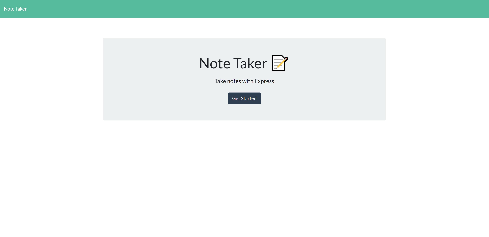
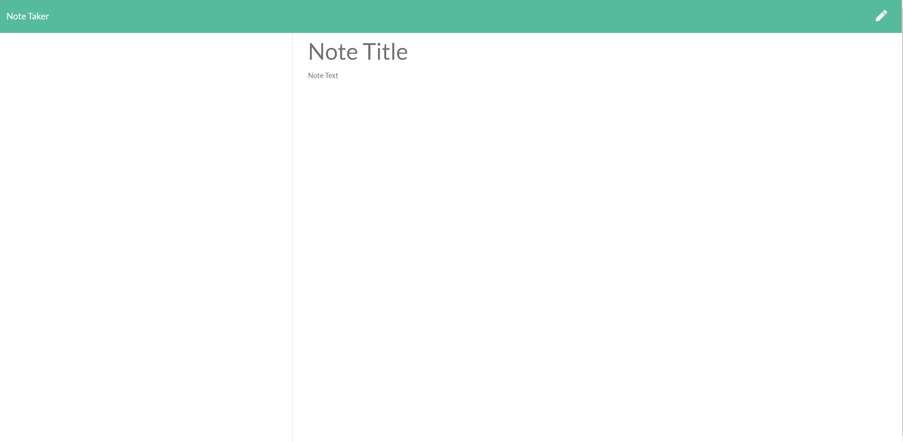
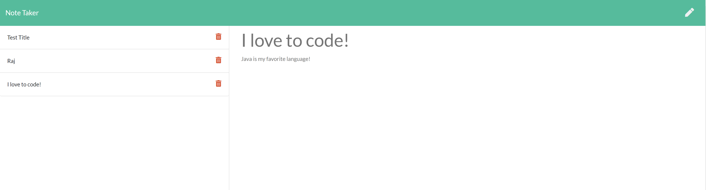

# NoteTaker

## Table of Contents

- [Description](#Description)
- [Tools_Used](#Tools_Used)
- [Links](#Links)
- [Application-Screen-Shots](#Application-Screen-Shots)
- [Credits](#Credits)

## Description

The NoteTaker application is a web application that allows users to gather their thoughts and take notes using a simple UI. Specifically, NoteTaker allows users to write, save, and delete notes.

For users that need to keep track of a lot of information, it's easy to forget or be unable to recall something important. Being able to take persistent notes allows users to have written information available when needed.

## Tools Used

- HTML
- CSS
- JavaScript
- Bootstrap
- jQuery
- NPM express
- NPM nodemon

## Links (Application & Repo)

NoteTaker can be accessed at heroku link provided below:

Heroku Pages URL: <https://note-takerz.herokuapp.com/>

Github Repository: <https://github.com/rajdeep24/NoteTaker>

### Screenshots

#### Homepage

#### Notes Page

#### Saved Notes

## Credits

I would like to credit georgia tech's coding bootcamp and the support from my peers.

## Badges

